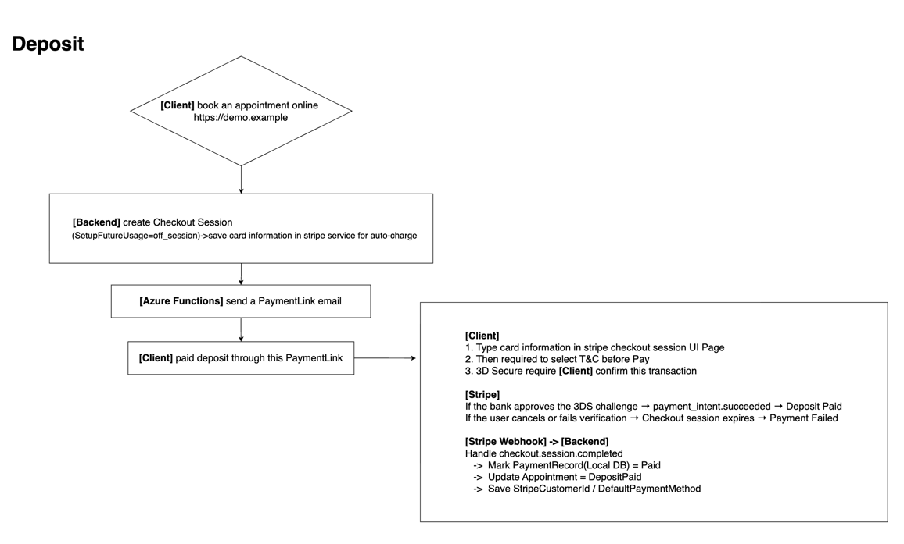
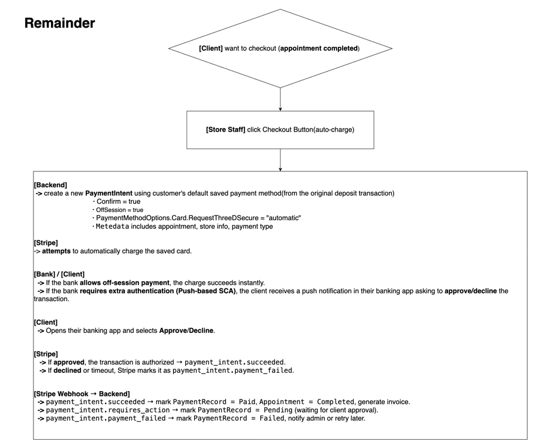
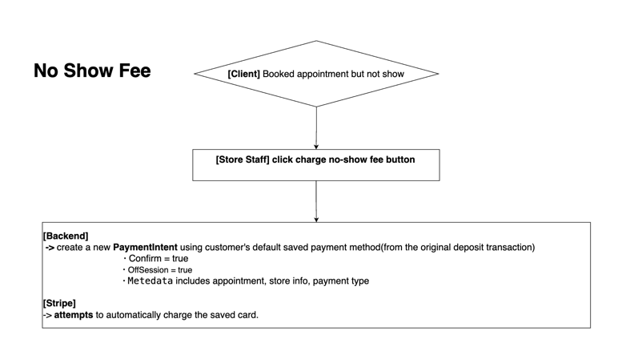

# Stripe Payments & Refund System Design(Demo)
This repository explains how to design a modern payment and refund system for an appointment booking platform using **ASP.NET Core** and **Stripe**.
 
### ✅ Key Concepts
- Deposit payments using **Stripe Checkout Session**
- Auto-charge(Remainder/NoShowFee) using **Stripe PaymentIntents**
- Idempotent operations with **Idempotency Keys**
- **Event-driven** updates via Stripe **webhooks**
- **Entity Framework Core** used for persistence

### ✅ Core Entities
- `PaymentRecord` — tracks each Stripe payment (deposit, remainder, no-show)
- `RefundRecord` — tracks refunds and their Stripe statuses
- `Appointment` (or Booking) — represents the service being paid for

### ✅ Payment Flow (Deposit, Remainder, NoShowFee Example)

